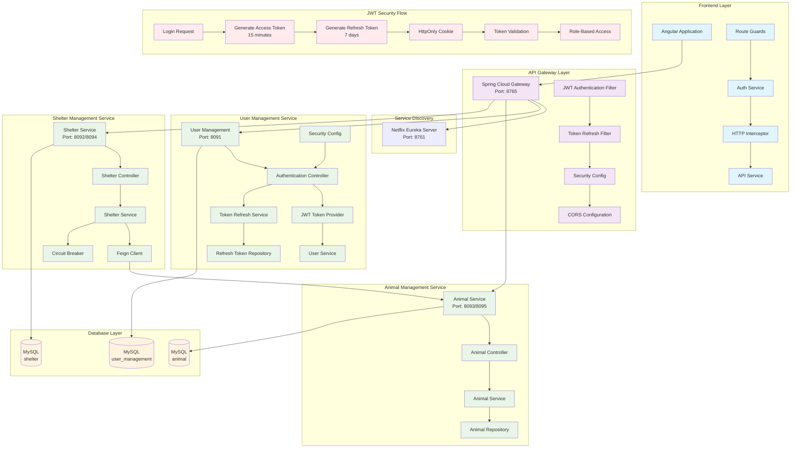
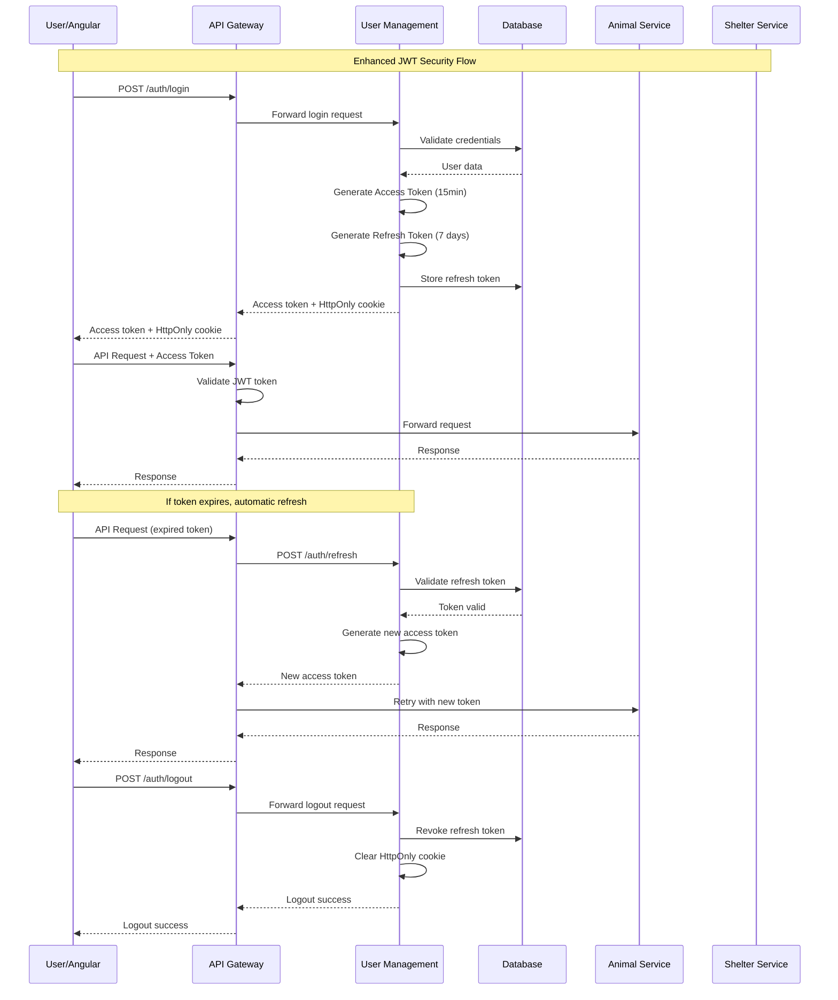
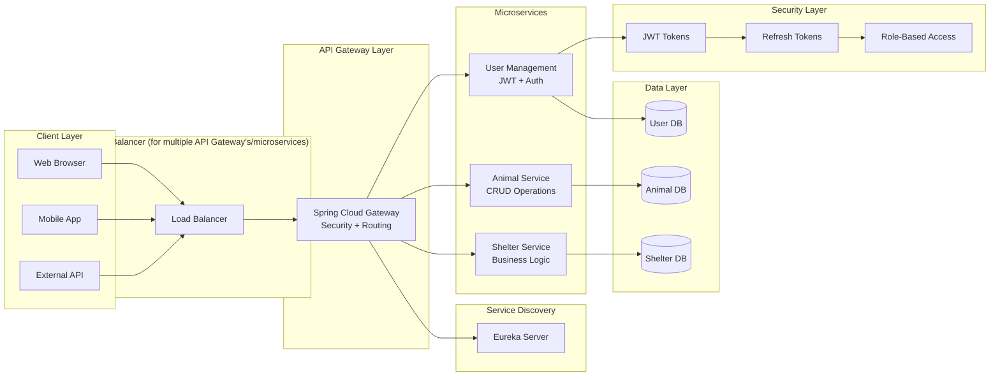
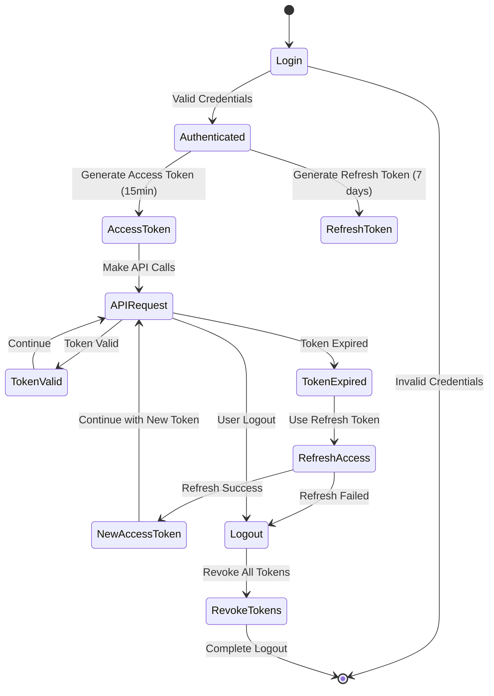
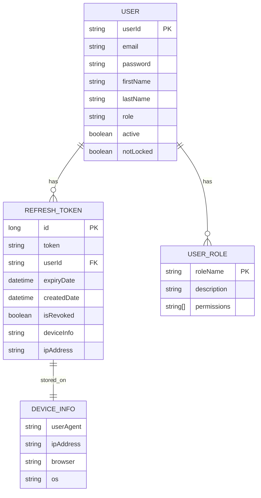

# Microservices Architecture Diagram

## 🏗️ Complete System Architecture with Enhanced JWT Security

### **Mermaid Diagram Specification**

## 🔐 Enhanced Security Flow Diagram

## 🏛️ Microservices Architecture Overview

## 🔄 Token Management Flow

## 📊 Component Relationships

## 🛡️ Security Architecture

```mermaid
graph TB
    subgraph "Security Layers"
        L1[Frontend Security<br/>HttpOnly Cookies<br/>XSS Protection]
        L2[API Gateway Security<br/>JWT Validation<br/>CORS Configuration]
        L3[Service Security<br/>Role-Based Access<br/>Token Validation]
        L4[Database Security<br/>Encrypted Passwords<br/>Token Blacklisting]
    end
    
    subgraph "Security Components"
        SC1[Authentication Manager]
        SC2[JWT Token Provider]
        SC3[Token Refresh Service]
        SC4[Security Filters]
        SC5[Password Encoder]
    end
    
    subgraph "Security Features"
        SF1[Access Tokens - 15min]
        SF2[Refresh Tokens - 7 days]
        SF3[HttpOnly Cookies]
        SF4[Role-Based Access Control]
        SF5[Device Tracking]
        SF6[IP Address Logging]
        SF7[Token Blacklisting]
    end
    
    L1 --> L2
    L2 --> L3
    L3 --> L4
    
    SC1 --> SC2
    SC2 --> SC3
    SC3 --> SC4
    SC4 --> SC5
    
    SF1 --> SF2
    SF2 --> SF3
    SF3 --> SF4
    SF4 --> SF5
    SF5 --> SF6
    SF6 --> SF7
```

## 🎯 Key Architecture Points

### **Security Flow:**
1. **User Login** → Dual token generation
2. **API Requests** → Access token validation
3. **Token Expiry** → Automatic refresh
4. **Logout** → Token revocation

### **Microservices Communication:**
1. **API Gateway** → Central entry point
2. **Service Discovery** → Eureka registration
3. **Inter-service** → Feign client communication
4. **Database** → Separate databases per service

### **Security Features:**
1. **HttpOnly Cookies** → XSS protection
2. **Token Blacklisting** → Secure logout
3. **Device Tracking** → Security monitoring
4. **Role-Based Access** → Granular permissions

---

